# Dokumentasi Tugas Web CiviGo (Web #1–#6)

Dokumen ini menjelaskan, langkah demi langkah, apa yang sudah dikerjakan untuk setiap tugas **Web** di
[`todos-arsip-03-10-2026.txt`](./todos-arsip-03-10-2026.txt) (daftar tugas lama, dipindahkan dari `todos.txt` pada 06/10/2026):
- alur yang dialami petugas;
- apa yang dilakukan sistem di setiap langkah;
- semua kasus (berhasil, ditolak, dan kasus pinggir) beserta pesan yang muncul;
- masalah yang masih diketahui.

Kondisi per 03/10/2026, termasuk perbaikan hasil audit sore hari (lihat [Perbaikan setelah audit](#perbaikan-setelah-audit-03102026)).

## Daftar isi

1. [Ringkasan status](#ringkasan-status)
2. [Dasar yang berlaku di semua halaman admin](#dasar-yang-berlaku-di-semua-halaman-admin)
3. [Web #1 — Manajemen loket](#web-1--manajemen-loket-adminloket)
4. [Web #2 — CRUD layanan](#web-2--crud-layanan-adminlayanan)
5. [Web #3 — Halaman ulasan](#web-3--halaman-ulasan-adminulasan)
6. [Web #4 — Login instansi](#web-4--login-instansi-)
7. [Web #5 — Antrean loket & mundurkan antrean](#web-5--antrean-loket--mundurkan-antrean-adminantrean)
8. [Profil & ubah password (daftar baru #4–#5)](#profil--ubah-password-adminprofil-daftar-baru-45-06102026)
9. [Kios walk-in tanpa sesi jam (daftar baru #2)](#kios-walk-in-tanpa-sesi-jam-displayselect-layanan-daftar-baru-2-06102026)
10. [Beranda: rentang waktu (daftar baru #3)](#beranda-rentang-waktu-admin-daftar-baru-3-06102026)
11. [Web #6 — Halaman reset password (tidak dilanjutkan)](#web-6--halaman-reset-password-tidak-dilanjutkan)
12. [Perbaikan setelah audit (03/10/2026)](#perbaikan-setelah-audit-03102026)
13. [Masalah yang masih diketahui](#masalah-yang-masih-diketahui)
14. [Lampiran: cara menguji, file, dan riwayat commit](#lampiran)

---

## Ringkasan status

| # | Tugas | Status | Tanggal | Commit utama |
|---|---|---|---|---|
| 1 | Tambah, ubah, hapus, aktif/nonaktif loket | Selesai | 18/09, diperketat 28/09/2026 | `fc2166e` (Satya), `2ee9967` |
| 2 | CRUD layanan + pemilih dokumen | Selesai | 28/09/2026 | `34ec583` (PR #1) |
| 2+ | Follow-up: prasyarat "kondisi" | Selesai | 03/10/2026 | `c79295e` |
| 3 | Halaman ulasan dengan filter asli | Selesai | 28/09/2026 | `34ec583` (PR #1), `022c289` |
| 4 | Login instansi | Selesai | 12/09/2026 | `810cd50` (Satya) |
| 5 | Tombol "Mundurkan Antrean" | Selesai | 03/10/2026 | `06f5a8a` |
| — | Perbaikan hasil audit Web #1, #4, #5 | Selesai | 03/10/2026 | `76cd9ff` |
| 6 | Halaman `/reset-password` | Tidak dilanjutkan | 06/10/2026 | diganti Profil & ubah password |
| baru #4–#5 | Profil, ubah password, toggle tampilkan password | Selesai | 06/10/2026 | `36cb675` |
| baru #2 | Kios walk-in tanpa pilih sesi jam | Selesai | 06/10/2026 | `f3bcd3b` |
| baru #3 | Rentang waktu di Beranda | Selesai | 06/10/2026 | — |

"Selesai" berarti fiturnya sudah dibangun dan berjalan sesuai tugas. Celah yang masih ada dicatat terpisah di
[Masalah yang masih diketahui](#masalah-yang-masih-diketahui).

---

## Dasar yang berlaku di semua halaman admin

Aturan ini dipakai oleh semua tugas di bawah, jadi dijelaskan sekali di sini.

1. **Hanya petugas yang bisa masuk `/admin`.** Layout admin memanggil `requireOfficer()`. Tanpa sesi, atau
   kalau akunnya akun warga (`role = 'user'`), pengunjung diarahkan kembali ke halaman login (`/`).
2. **Setiap petugas terikat instansi dan cabang.** Profil di `public.users` punya `agency_id` (instansi) dan
   `location_id` (cabang fisik). Halaman admin hanya menampilkan data instansi itu; loket dan antrean juga hanya cabang itu.
3. **Server tidak percaya id dari browser.** Server memakai `service_role` (melewati RLS), jadi setiap aksi menulis
   dibatasi `agency_id` petugas (dan `location_id` untuk loket). Cara menolaknya berbeda per jenis aksi:
   - **server action** (loket, layanan): id milik instansi lain dijawab "tidak ditemukan", tanpa menulis apa pun;
   - **API antrean** (`/api/queue/...`): tiket atau loket instansi lain dijawab `403 WRONG_AGENCY`.

   Server action sebenarnya endpoint POST yang bisa dipanggil tanpa lewat UI, jadi validasi di browser saja tidak cukup.
4. **Sesi habis di tengah aksi** mengarahkan ke halaman login, bukan menampilkan pesan error "NEXT_REDIRECT".

---

## Web #1 — Manajemen loket (`/admin/loket`)

**Tujuan:** petugas mengelola loket fisik di cabangnya, yaitu menambah, mengganti nama, membuka/menutup, dan menghapus.
**Kode:** `lib/data/counter-actions.ts`, `app/components/admin/LoketTableManager.tsx`.

### Alur langkah demi langkah

**A. Menambah loket**

| # | Petugas | Sistem & layar |
|---|---|---|
| 1 | Membuka **Loket** di sidebar, klik **Tambah Loket**. | Muncul form dengan isian nama (contoh "Loket 9"). |
| 2 | Mengisi nama, klik **Simpan Loket**. | Server membaca `agency_id` dan `location_id` dari **profil petugas**, bukan dari form. |
| 3 | — | Loket disimpan dengan status **Aktif**. Pesan: `Loket "Loket 9" berhasil ditambahkan.` |
| 4 | — | Halaman Loket, Beranda, dan Antrean ikut diperbarui; loket baru langsung muncul sebagai tab di Antrean. |

**B. Mengganti nama loket**

| # | Petugas | Sistem & layar |
|---|---|---|
| 1 | Klik ikon pensil (**Ubah Nama Loket**) di baris loket. | Muncul form berisi nama lama. |
| 2 | Mengetik nama baru, klik **Simpan Perubahan**. | Server memastikan loket itu milik instansi **dan** cabang petugas. |
| 3 | — | Nama diganti. Pesan: `Nama loket berhasil diperbarui.` |

**C. Membuka / menutup loket**

| # | Petugas | Sistem & layar |
|---|---|---|
| 1 | Klik ikon power (**Tutup Loket** / **Buka Loket**) atau badge status. | Server memastikan kepemilikan loket, lalu mengubah `active` ↔ `inactive`. |
| 2 | — | Pesan: `Status loket berhasil diubah menjadi Aktif.` (atau `Nonaktif`). |
| 3 | — | Loket nonaktif **hilang** dari layar TV dan dari tab di halaman Antrean, jadi tidak bisa dipakai memanggil. |

**D. Menghapus loket**

| # | Petugas | Sistem & layar |
|---|---|---|
| 1 | Klik ikon tempat sampah (**Hapus Loket**). | Muncul konfirmasi `Hapus "Loket …"?` |
| 2 | Mengonfirmasi. | Server memastikan kepemilikan loket, lalu mengecek apakah loket pernah dipakai di antrean. |
| 3a | — | **Belum pernah dipakai:** loket dihapus permanen. Pesan: `Loket berhasil dihapus.` |
| 3b | — | **Sudah punya riwayat antrean:** loket **tidak dihapus**, melainkan dinonaktifkan supaya riwayat tetap utuh. Pesan: `Loket memiliki riwayat antrean, sehingga statusnya otomatis diubah menjadi Nonaktif.` |

### Semua kasus

| Kasus | Hasil |
|---|---|
| Tambah dengan nama kosong / spasi saja | `Nama loket wajib diisi.` |
| Tambah dari akun yang belum punya `location_id` | `Akun Anda belum terhubung ke lokasi cabang, jadi loket baru tidak bisa ditempatkan. Minta admin mengisi lokasi cabang akun Anda.` (Dulu diam-diam ditaruh di lokasi 1.) |
| Ubah nama menjadi kosong | `Nama loket tidak boleh kosong.` |
| Id loket bukan bilangan bulat positif | `Loket tidak valid.` |
| Status yang dikirim bukan `active`/`inactive` | `Status loket tidak valid.` |
| Ubah/buka-tutup/hapus loket milik **instansi lain** | `Loket tidak ditemukan di instansi atau cabang Anda.` Tidak ada yang ditulis. |
| Ubah/buka-tutup/hapus loket instansi sendiri tapi **cabang lain** | Pesan yang sama. Akun tanpa `location_id` boleh mengelola semua loket instansinya. |
| Hapus loket yang punya riwayat antrean | Tidak dihapus, otomatis dinonaktifkan. |
| Nama loket sama dengan loket lain di cabang yang sama | **Diterima** (tidak dicek). Lihat [masalah yang diketahui](#masalah-yang-masih-diketahui). |
| Semua loket cabang dinonaktifkan | Halaman Antrean menampilkan "Belum Ada Loket Aktif" tanpa tombol panggil (lihat Web #5). |
| Sesi habis saat menekan tombol | Diarahkan ke halaman login. |

### Catatan

- **Loket tidak punya jam operasional.** Jam buka diatur per instansi (`agencies.open_time`, `close_time`,
  `operating_days`). Kolom "Jadwal Buka" lama yang isinya selalu "Senin - Jumat / 08:00 - 16:00" (hardcoded) sudah dihapus.
- Kolom **"Dibuat Pada"** selalu "-" karena tabel `counters` tidak punya kolom `created_at`.

---

## Web #2 — CRUD layanan (`/admin/layanan`)

**Tujuan:** petugas mengelola katalog layanan instansinya, yaitu nama, estimasi waktu, prasyarat, dokumen output, dan info prosedur.
**Kode:** `lib/data/service-actions.ts`, `app/components/admin/LayananManager.tsx`, `ServiceDocumentPicker.tsx`.

### Konsep penting: katalog dokumen

- Prasyarat dan dokumen output **dipilih dari katalog** `service_documents`, bukan diketik bebas.
- Katalog ini **dipakai bersama semua instansi**. Contoh: "KTP Asli" milik Disdukcapil juga jadi syarat Samsat dan Imigrasi.
  Karena itu pemilih menampilkan semua item, dengan item milik instansi sendiri di urutan atas.
- Di tabel `services`, setiap pilihan disimpan **dua kali**: sebagai id (`requirement_doc_ids`, `output_doc_ids`)
  dan sebagai nama teks (`requirements`, `output_documents`) yang dibaca aplikasi mobile. Server hanya menerima id,
  lalu mengambil namanya sendiri dari katalog, supaya id dan nama tidak pernah berselisih.
- Sejak 03/10/2026 setiap item katalog punya **jenis** (`type`):
  - **dokumen**: berkas yang dibawa warga (mis. "KTP Asli");
  - **kondisi**: syarat yang bukan berkas (mis. "Berusia 17 Tahun", "Smartphone dengan koneksi internet", "Email aktif").

  Aplikasi mobile membaca jenis ini lewat `GET /api/services/{id}/prerequisites`.

### Alur langkah demi langkah

**A. Menambah layanan**

| # | Petugas | Sistem & layar |
|---|---|---|
| 1 | Membuka **Layanan**, klik **Tambah Layanan**. | Muncul form "Tambah Layanan Baru". |
| 2 | Mengisi **Nama Layanan** (wajib) dan **Estimasi (menit)** (opsional). | — |
| 3 | Di **Prasyarat Dokumen**, mencari lalu mencentang item. | Item berjenis kondisi diberi label kuning **KONDISI**. |
| 4 | Di **Dokumen Output**, mencentang dokumen yang diterima warga setelah layanan selesai. | Kondisi **tidak ditampilkan** di sini. |
| 5 | Mengisi **Info Prosedur** (opsional), klik **Simpan Layanan**. | Server memvalidasi isian, mengecek nama belum dipakai layanan lain di instansi ini, lalu mengambil nama dokumen dari katalog. |
| 6 | — | Pesan: `Layanan "…" berhasil ditambahkan.` Layanan muncul di tabel. |

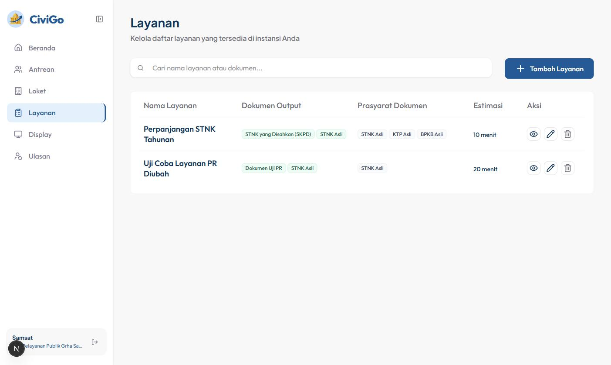

> Screenshot Web #2 diambil 28/09/2026, sebelum label "KONDISI" ditambahkan.

**B. Menambah item baru ke katalog dari form**

| # | Petugas | Sistem & layar |
|---|---|---|
| 1 | Mengetik nama yang belum ada di kotak cari pemilih (mis. "Surat Kuasa"). | Daftar kosong dan muncul tombol tambah. |
| 2a | Di **pemilih prasyarat**: klik **Tambah "…" sebagai dokumen** (atau tekan Enter), atau **Tambah sebagai kondisi**. | Item disimpan ke katalog atas nama instansi petugas, dengan jenis yang dipilih. |
| 2b | Di **pemilih output**: klik **Tambah "…" ke katalog dokumen**. | Item selalu berjenis dokumen. |
| 3 | — | Item langsung tercentang. Pesan: `Dokumen "…" ditambahkan ke katalog.` atau `Kondisi "…" ditambahkan ke katalog.` |

**C. Melihat detail, mengubah, dan mencari**

| # | Petugas | Sistem & layar |
|---|---|---|
| 1 | Klik ikon mata (**Lihat**) di baris layanan. | Detail: estimasi, prasyarat (kondisi berlabel KONDISI), dokumen output, info prosedur. |
| 2 | Klik **Ubah Layanan** di detail, atau ikon pensil di tabel. | Form "Ubah Layanan", sudah terisi. |
| 3 | Mengubah isian, klik **Simpan Perubahan**. | Validasi sama dengan tambah. Pesan: `Layanan "…" berhasil diperbarui.` |
| 4 | Mengetik di **Cari nama layanan atau dokumen...** | Tabel disaring per nama layanan, info prosedur, nama prasyarat, dan nama dokumen output. |

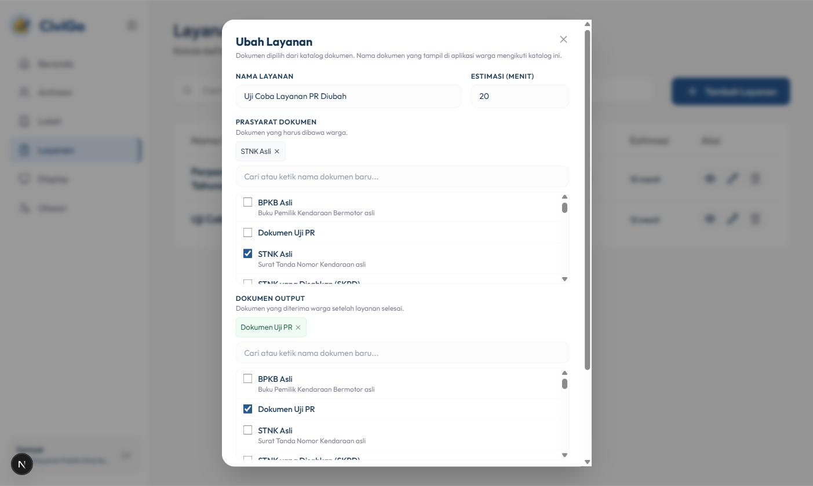
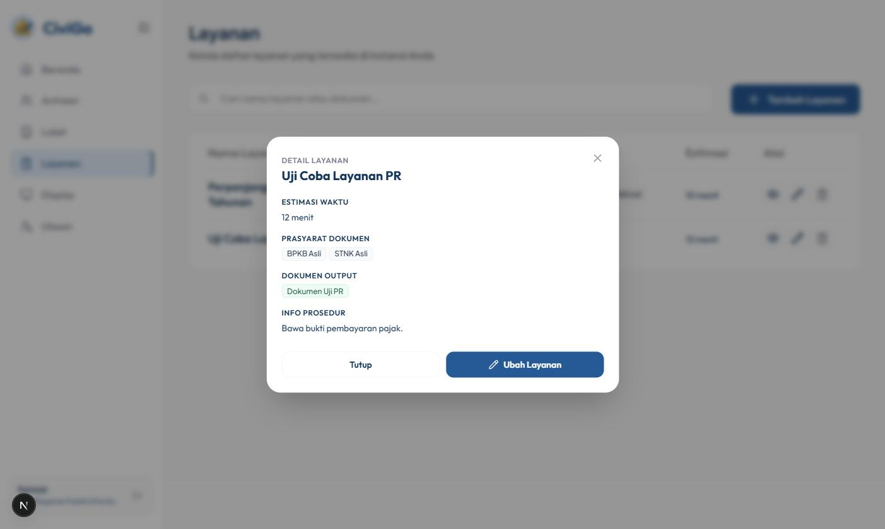
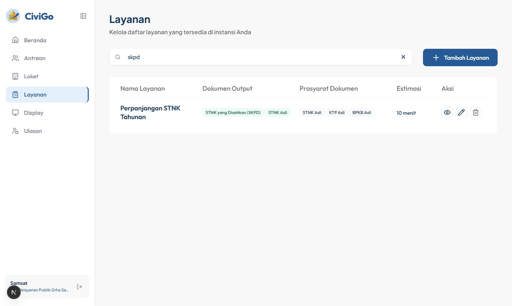

**D. Menghapus layanan**

| # | Petugas | Sistem & layar |
|---|---|---|
| 1 | Klik ikon tempat sampah (**Hapus Layanan**), lalu konfirmasi. | Server mengecek apakah layanan pernah dipakai di antrean atau ulasan. |
| 2a | — | **Belum pernah dipakai:** dihapus permanen. Pesan: `Layanan "…" berhasil dihapus.` |
| 2b | — | **Sudah dipakai:** ditolak, karena `services` tidak punya status aktif/nonaktif dan riwayatnya dibutuhkan laporan. Pesan menyebut jumlahnya, mis. `Layanan "…" tidak dapat dihapus karena sudah memiliki riwayat 12 antrean dan 3 ulasan. Riwayat tersebut dipertahankan untuk laporan.` |

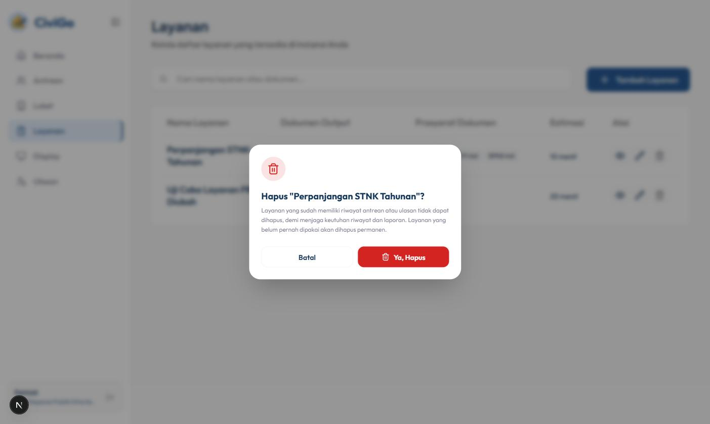
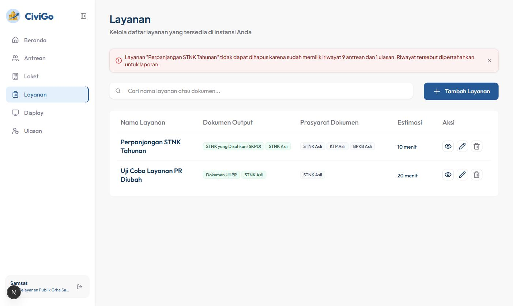

### Semua kasus

| Kasus | Hasil |
|---|---|
| Nama layanan kosong | `Nama layanan wajib diisi.` |
| Nama lebih dari 150 karakter | `Nama layanan maksimal 150 karakter.` |
| Nama sudah dipakai layanan lain **di instansi yang sama** (huruf besar/kecil tidak dibedakan) | `Layanan "…" sudah ada di instansi ini.` Nama yang sama di instansi lain boleh. |
| Estimasi bukan bilangan bulat 1–480 | `Estimasi waktu harus bilangan bulat 1–480 menit.` Estimasi boleh kosong. |
| Info prosedur lebih dari 2000 karakter | `Info prosedur maksimal 2000 karakter.` |
| Daftar id dokumen rusak (bukan bilangan bulat positif) | `Daftar dokumen tidak valid.` Id ganda dibuang otomatis. |
| Dokumen yang dipilih sudah tidak ada di katalog | `Sebagian dokumen yang dipilih tidak ada di katalog. Muat ulang halaman.` |
| **Kondisi** dikirim sebagai dokumen output (mis. lewat panggilan langsung) | `"…" adalah kondisi, bukan dokumen, jadi tidak bisa menjadi dokumen output.` |
| Mengetik nama kondisi yang sudah ada di **pemilih output** | Daftar menampilkan `"…" ada di katalog sebagai kondisi, jadi tidak bisa menjadi dokumen output.` Tombol tambah tidak muncul. |
| Menambah item katalog yang **namanya sudah ada** (huruf besar/kecil tidak dibedakan) | Tidak dibuat duplikat. Item yang ada langsung dipilih, pesan `Dokumen "…" sudah ada di katalog.` (atau `Kondisi …`), apa pun jenis yang dipilih. |
| Nama item katalog kosong / lebih dari 150 karakter | `Nama dokumen wajib diisi.` / `Nama dokumen maksimal 150 karakter.` |
| Jenis item bukan `dokumen`/`kondisi` | `Jenis dokumen tidak valid.` |
| Mengubah **jenis** item katalog yang sudah ada | Sengaja tidak tersedia di dasbor: katalog dipakai lintas instansi, jadi satu instansi tidak boleh mengubah klasifikasi milik instansi lain. Koreksi lewat SQL/migrasi. |
| Ubah/hapus layanan milik **instansi lain** (lewat id) | `Layanan tidak ditemukan di instansi Anda.` Tidak ada yang ditulis. |
| Hapus layanan yang punya antrean/ulasan | Ditolak dengan jumlah riwayatnya. |
| Hapus layanan yang belum pernah dipakai | Dihapus permanen. |
| Pencarian tidak menemukan apa pun | `Tidak ada layanan yang cocok dengan "…".` |

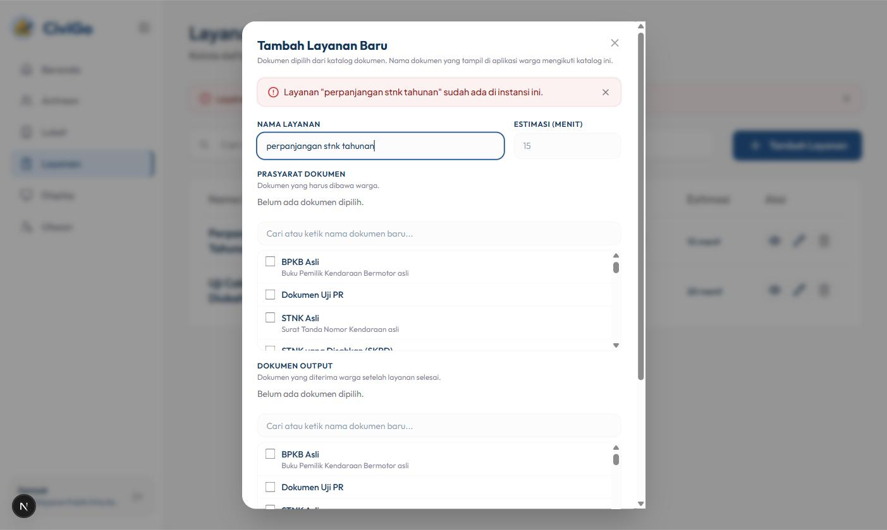
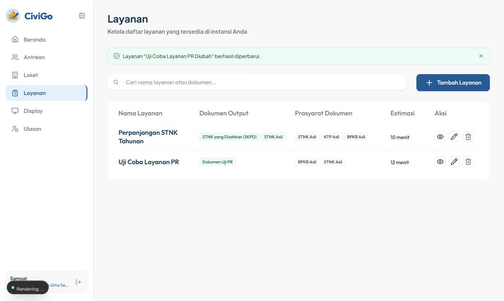

### Catatan

- Badge "Aktif" di tabel layanan dihapus: nilainya selama ini hardcoded, kolomnya tidak ada di database.
- `GET /api/services` tidak diubah (bentuk respons sama untuk mobile).
- Kalau sebuah layanan lama tidak punya `requirement_doc_ids`, endpoint prerequisites (kode Satya) menebak jenis
  dari kata di nama (`usia`, `tahun`, `wajib`, dst.). Layanan yang disimpan lewat dasbor selalu punya id, jadi
  tebakan ini hanya berlaku untuk data lama.

---

## Web #3 — Halaman ulasan (`/admin/ulasan`)

**Tujuan:** petugas melihat penilaian warga untuk instansinya, dengan statistik dan filter.
**Kode:** `app/admin/ulasan/page.tsx`, `getAdminReviews()` dan `getReviewFilterOptions()` di `lib/data/admin.ts`.

### Alur langkah demi langkah

| # | Petugas | Sistem & layar |
|---|---|---|
| 1 | Membuka **Ulasan** di sidebar. | Tanpa filter, semua ulasan instansi ditampilkan. |
| 2 | Membaca statistik di bagian atas. | **Total Ulasan**; **Rata-rata** (skala /5); **Sangat Puas** (persentase bintang 5); **Bulan Ini** (rata-rata sejak tanggal 1 bulan berjalan, dihitung dalam **WIB**); **rincian rating** 1–5 dalam persen. Tanpa ulasan, rata-rata dan "Sangat Puas" tampil "-". |
| 3 | Memilih filter **Layanan**, **Loket**, dan/atau **Rating**. | Pilihan diisi dari layanan dan loket instansi sendiri. |
| 4 | — | Filter disimpan di URL (`?layanan=3&loket=3&rating=5`), jadi halaman bisa dibagikan atau di-refresh tanpa hilang. |
| 5 | — | Statistik, rincian rating, dan daftar ulasan **semuanya** mengikuti filter. Waktu setiap ulasan ditampilkan dalam WIB. |

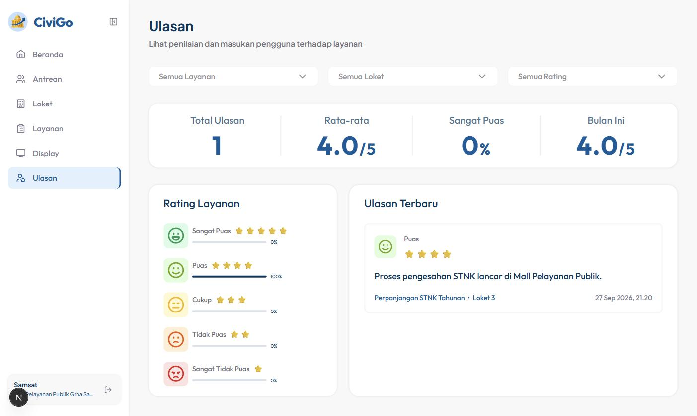
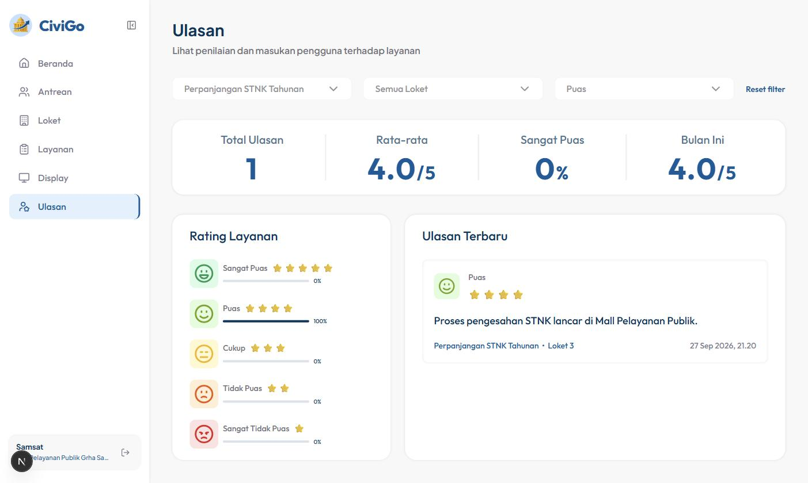

### Semua kasus

| Kasus | Hasil |
|---|---|
| Tidak ada filter | Semua ulasan instansi. |
| Satu atau kombinasi filter | Statistik, rincian, dan daftar disaring bersamaan. |
| Nilai URL tidak sah: id layanan/loket instansi lain, rating 7, teks acak | Dianggap **"Semua"** untuk filter itu, supaya dropdown dan data selalu sama. |
| Dua loket bernama sama di cabang berbeda | Opsi loket diberi keterangan cabang, mis. `Loket 1 (Cabang #2)`. |
| Instansi belum punya ulasan / filter tidak menemukan apa pun | Angka nol dan tampilan kosong (empty state). Tidak ada data karangan. |
| Query database gagal | Error dilempar seperti halaman admin lain, bukan diganti data palsu. |

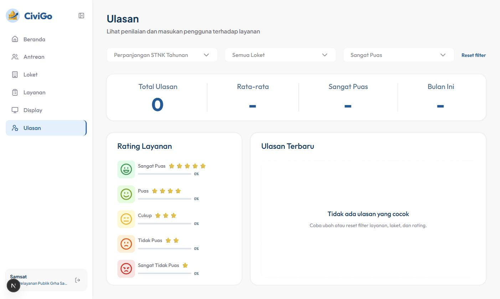

### Perubahan pendukung: `POST /api/reviews` (dipakai mobile)

Saat mengerjakan filter loket ditemukan ulasan Samsat yang menunjuk loket Disdukcapil, jadi endpoint pengiriman ulasan diperketat:

| Kasus | Respons |
|---|---|
| Layanan, loket, atau antrean (`queue_id`) milik instansi lain | `422` `SERVICE_AGENCY_MISMATCH` / `COUNTER_AGENCY_MISMATCH` / `QUEUE_AGENCY_MISMATCH` |
| Id layanan/loket/antrean tidak ada | `404` `SERVICE_NOT_FOUND` / `COUNTER_NOT_FOUND` / `QUEUE_NOT_FOUND` (dulu `500`) |
| Id bukan bilangan bulat | `400 INVALID_ID` (dulu `500`) |
| `agency_id` / `service_id` tidak dikirim tapi ada `queue_id` | Tetap boleh, diturunkan dari antreannya. |

Data yang salah ikut dikoreksi 28/09/2026: ulasan Samsat id 8 dan dua tiket antrean (B-001 20/09, B-01 11/09)
yang tercatat di loket instansi lain. Sekarang 0 tiket dan 0 ulasan dengan relasi lintas instansi.

### Catatan

- Fallback data karangan (500 ulasan, rating 4.6, komentar contoh) sudah dihapus.
- Tidak ada filter per lokasi/cabang (tidak diperlukan).

---

## Web #4 — Login instansi (`/`)

**Tujuan:** petugas masuk ke dasbor instansinya; akun warga tidak boleh masuk.
**Kode:** `signIn()` di `lib/auth/actions.ts`, `lib/auth/session.ts`, `app/components/auth/LoginForm.tsx`.

### Alur langkah demi langkah

**A. Login**

| # | Petugas | Sistem & layar |
|---|---|---|
| 1 | Membuka `/`. | Kalau sudah login sebagai petugas, langsung diarahkan ke `/admin`. Kalau belum, tampil form "Masuk ke CiviGo". |
| 2 | Mengisi **Username / Email Instansi** dan **Password**, klik masuk. | Kalau yang diisi **username** (tanpa `@`), server mengubahnya menjadi `<prefix>@civigo.com`: `prefix` = bagian sebelum titik pertama, hanya huruf/angka. Contoh: `disdukcapil` → `disdukcapil@civigo.com`. |
| 3 | — | Server login ke Supabase Auth, lalu membaca `role` di `public.users`. |
| 4 | — | Akun **instansi** atau **super_admin** diarahkan ke `/admin`. Akun warga ditolak (lihat kasus). |

**B. Logout**

| # | Petugas | Sistem & layar |
|---|---|---|
| 1 | Klik ikon keluar di kartu akun, bawah sidebar. | Hanya sesi browser ini yang diakhiri (`signOut({ scope: "local" })`), lalu kembali ke `/`. Loket lain yang memakai akun cabang yang sama tetap login. Sebelum 06/10/2026 keluar di satu loket mengeluarkan semua loket (default supabase-js `global`). |

### Semua kasus

| Kasus | Hasil |
|---|---|
| Username/email atau kata sandi kosong | `Username/Email dan kata sandi wajib diisi.` |
| Username/email atau kata sandi salah | `Username atau kata sandi tidak sesuai.` |
| Login dengan akun **warga** (`role = 'user'`) | Sesi web itu saja yang diakhiri (sesi warga di aplikasi mobile tetap), pesan `Akun ini bukan akun instansi. Portal ini khusus untuk petugas pelayanan instansi.` |
| Login dengan akun instansi / super_admin | Masuk ke `/admin`. |
| Username bertitik, mis. `disdukcapil.mpp` | Tetap menjadi `disdukcapil@civigo.com`. Akun per cabang harus login dengan **email lengkap**. |
| Membuka `/admin` tanpa login, atau dengan sesi akun warga | Diarahkan kembali ke `/`. |

### Catatan

- Contoh di kolom username dulu `disdukcapil.surabaya`, yang menyiratkan username per cabang berfungsi. Sejak 03/10/2026
  contohnya `disdukcapil atau email lengkap akun Anda`.
- Endpoint mobile `POST /api/auth/login` (Satya, 03/10/2026) memakai aturan username yang sama, dan juga bisa login dengan NIK 16 digit.
- Akun uji ada di [`supabase-backend-integration-notes.md`](./supabase-backend-integration-notes.md) bagian 8B.

---

## Web #5 — Antrean loket & mundurkan antrean (`/admin/antrean`)

**Tujuan:** petugas loket memanggil, menyelesaikan, menghanguskan, dan **memundurkan** antrean. Mundurkan dipakai untuk warga
yang sudah dipanggil tapi belum siap (mis. "fotokopi KK dulu"): tiketnya pindah ke urutan paling akhir tanpa dihanguskan.
**Kode:** `lib/queue/ordering.ts`, `lib/queue/status.ts`, `app/components/admin/AntreanManager.tsx`, `app/admin/antrean/page.tsx`.
Analisis dan simulasi sebelum/sesudah: [`web5-mundurkan-antrean.md`](./web5-mundurkan-antrean.md).

### Status tiket

| Dari | Ke | Lewat |
|---|---|---|
| `scheduled` (booking, belum datang) | `present` (sudah hadir) | Check-in di kios. |
| `scheduled` | `served` (sedang dilayani) | Dipanggil sebelum check-in. Terjadi lewat "Panggil Antrean Berikutnya" begitu nomornya tiba gilirannya: sejak 06/10/2026 status check-in tidak mempengaruhi urutan. |
| `present` | `served` | Dipanggil ke loket. |
| `served` | `completed` (selesai) | **Selesaikan Layanan**. Waktu selesai dicatat di `completed_at` oleh trigger database. |
| `served` | `present` + `postponed = true` | **Mundurkan Antrean**. |
| `scheduled` / `present` / `served` | `skipped` (hangus) | **Hanguskan Antrean** (atau lewat API). |

`completed` dan `skipped` adalah status final.

### Urutan panggil (satu sumber untuk semua tampilan)

`sortWaiting()` di `lib/queue/ordering.ts` dipakai tombol **Panggil Antrean Berikutnya**, kartu **Selanjutnya** dan
**Sisa Antrean** di dasbor, dan **Antrean Berikutnya** di layar TV:

1. Tiket yang belum pernah dimundurkan dulu. Yang dimundurkan paling belakang, **di belakang semua orang
   termasuk yang belum check-in** (keputusan 03/10/2026, opsi A).
2. Sesama dimundurkan: yang lebih dulu dimundurkan dipanggil lebih dulu.
3. Sesi jam yang lebih awal; tiket tanpa sesi di belakang.
4. Nomor antrean — **sudah check-in atau belum tidak berpengaruh**.

> **Perubahan 06/10/2026 (`9c6273d`, Satya), disengaja:** aturan "`present` (sudah check-in) sebelum `scheduled`
> (belum datang)" dihapus. Antrean dipanggil sesuai nomornya, termasuk warga yang belum check-in di kios.
> Contoh: B-001 booking tapi belum check-in, B-002 sudah check-in → yang dipanggil lebih dulu **B-001**
> (dulu B-002). Kalau warganya tidak ada, petugas menghanguskan atau memundurkannya.

### Alur langkah demi langkah

**A. Membuka halaman antrean**

| # | Petugas | Sistem & layar |
|---|---|---|
| 1 | Membuka **Antrean** di sidebar. | Server memuat antrean hari ini (WIB) milik instansi + cabang petugas, dan **hanya loket aktif** sebagai tab. |
| 2 | Memilih tab loket yang dijaga. | Kartu utama menampilkan tiket yang sedang dilayani di loket itu. Di bawahnya tiga kartu: **Sebelumnya**, **Sisa Antrean**, **Selanjutnya**. |
| 3 | — | Dasbor berlangganan sinyal realtime `display:agency:<id>` (sama dengan layar TV). Perubahan dari kios, loket lain, atau mobile muncul dalam ±2 detik. Refresh otomatis 30 detik tetap jalan sebagai cadangan. |

**B. Memanggil antrean**

| # | Petugas | Sistem & layar |
|---|---|---|
| 1 | Klik **Panggil Antrean Berikutnya**. | Server mengambil tiket teratas menurut urutan panggil dan mengubahnya menjadi `served` di loket ini. |
| 2 | — | Nomor tampil besar, diumumkan dengan suara ("Nomor antrean …, silakan menuju ke Loket …"), dan layar TV ikut berubah. |
| 3 | — | Rincian tiket: nama (atau "Tanpa akun (walk-in)"), sesi (atau **Tanpa sesi**), NIK tersamar, layanan. |
| 4 | — | Muncul tiga tombol: **Selesaikan Layanan** (hijau), **Mundurkan Antrean** (kuning), **Hanguskan Antrean** (merah). |

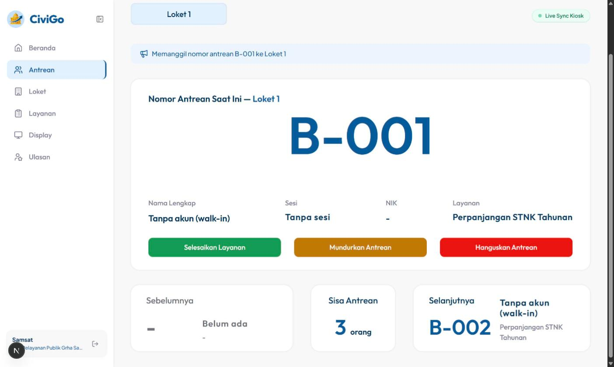

**C. Menyelesaikan layanan**

| # | Petugas | Sistem & layar |
|---|---|---|
| 1 | Klik **Selesaikan Layanan**. | Tiket menjadi `completed`; trigger database mengisi `completed_at`. |
| 2 | — | Pesan: `Antrean X berhasil diselesaikan.` Kartu **Sebelumnya** menampilkan tiket yang **paling akhir diselesaikan** di loket ini. |

**D. Memundurkan antrean**

| # | Petugas | Sistem & layar |
|---|---|---|
| 1 | Klik **Mundurkan Antrean** saat warga belum siap. | Server mengecek tiket masih `served`, lalu mengubahnya menjadi `present`, `postponed = true`, `postponed_at = sekarang`, dan melepas loketnya. |
| 2 | — | Pesan: `Antrean X dimundurkan ke urutan paling akhir.` Kartu **Selanjutnya** langsung menunjuk tiket yang benar-benar akan dipanggil berikutnya. |
| 3 | — | Ketika tiket yang dimundurkan menjadi berikutnya, kartu **Selanjutnya** memberi label kuning **Dimundurkan**, supaya petugas tahu orangnya mungkin sedang keluar sebentar. |

**E. Menghanguskan antrean**

| # | Petugas | Sistem & layar |
|---|---|---|
| 1 | Klik **Hanguskan Antrean** saat warga tidak datang setelah dipanggil. | Tiket menjadi `skipped` (final). Pesan: `Antrean X ditandai hangus.` Warga bisa menjadwalkan ulang lewat mobile. |

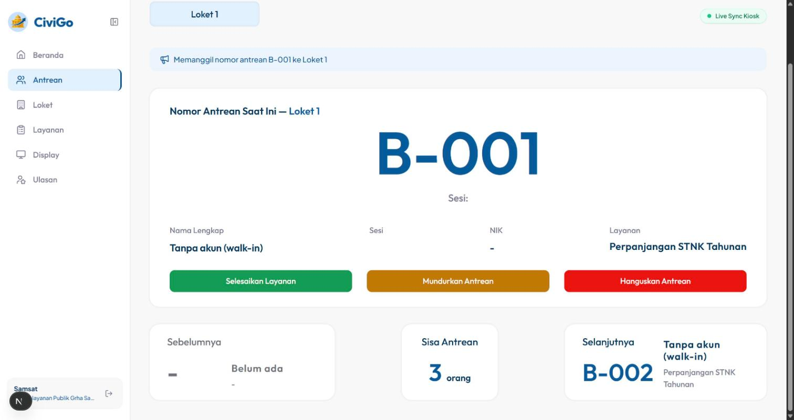
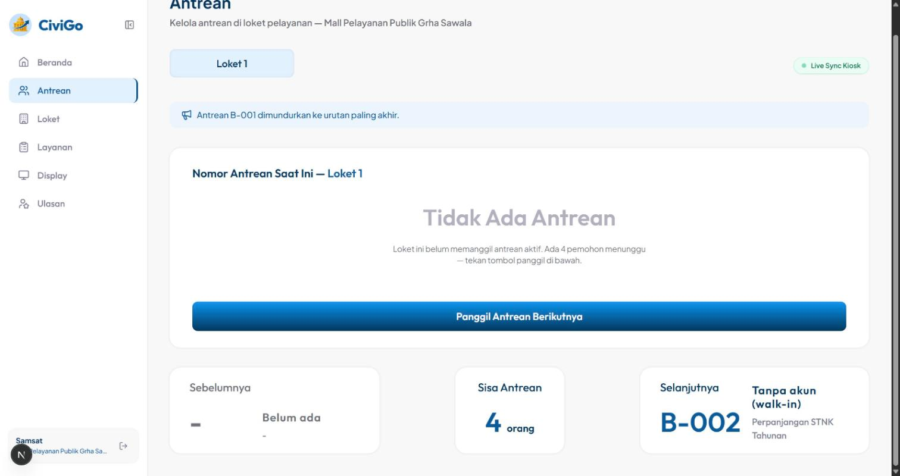
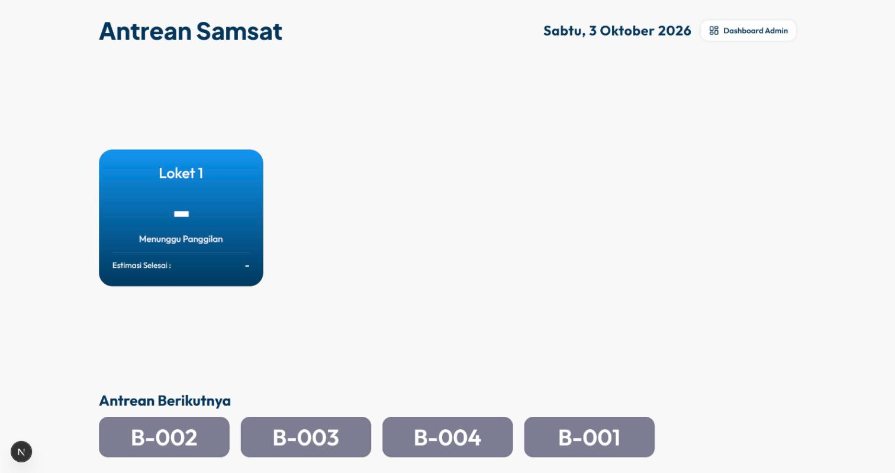
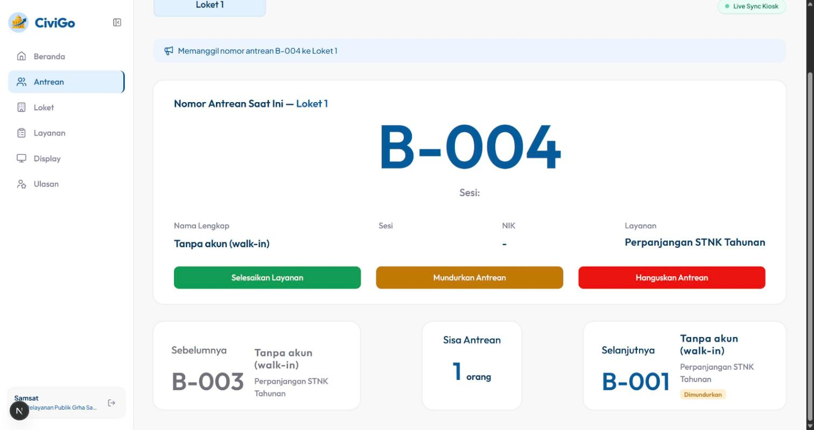

### Contoh lengkap (dari simulasi 03/10/2026)

B-001 dan B-002 sudah check-in, B-003 dan B-004 booking tapi belum datang. Hasilnya sama dengan urutan sejak
06/10/2026, karena di contoh ini yang sudah check-in kebetulan bernomor lebih kecil.

1. Panggil → **B-001**. B-001 minta waktu, petugas klik **Mundurkan Antrean**.
2. "Selanjutnya" berubah ke **B-002**. Layar TV: B-002 → B-003 → B-004 → B-001.
3. Panggil & selesaikan berturut-turut: **B-002 → B-003 → B-004**. Saat B-004 dilayani, "Selanjutnya" = B-001 dengan label **Dimundurkan**.
4. Panggil & selesaikan **B-001**. Kartu **Sebelumnya** = **B-001** (paling akhir selesai), bukan B-004.

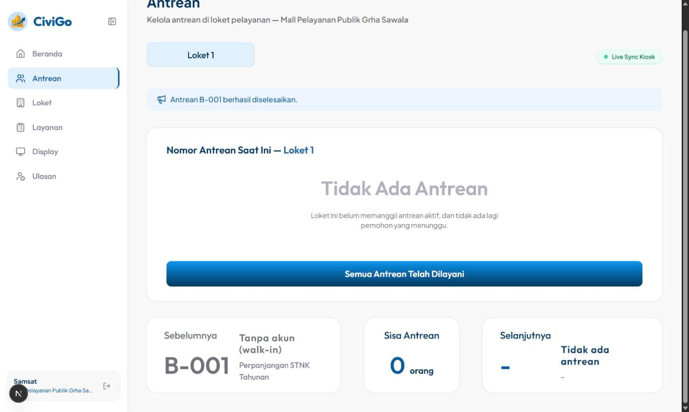

### Semua kasus

| Kasus | Hasil |
|---|---|
| Tiket belum check-in bernomor lebih kecil dari tiket yang sudah check-in (sesi sama) | Yang belum check-in dipanggil lebih dulu (sejak 06/10/2026). Kalau warganya tidak ada: hanguskan atau mundurkan. |
| Mundurkan tiket yang sedang dilayani | Berhasil: `present`, `postponed = true`, loket dilepas, pindah ke paling belakang. |
| Tiket yang sama dimundurkan lagi setelah dipanggil ulang | Berhasil; pindah ke belakang sesama tiket yang dimundurkan (urut waktu dimundurkan). Tidak ada batas jumlah. |
| Mundurkan tiket yang **belum dipanggil** (`scheduled`/`present`), mis. lewat API | `422 POSTPONE_REQUIRES_SERVED`: `Hanya antrean yang sedang dilayani di loket yang dapat dimundurkan. Tiket … berstatus terjadwal.` Tiketnya tidak berubah. |
| Mundurkan tiket yang sudah selesai/hangus | `422 CANNOT_POSTPONE_FINAL_STATUS` |
| Petugas lain menyelesaikan/menghanguskan tiket itu sesaat sebelumnya | `409 CONCURRENT_UPDATE`: `Status tiket baru saja diubah petugas lain. Muat ulang lalu coba lagi.` Perubahan petugas lain tidak ditimpa. |
| Dua loket menekan **Panggil** pada saat yang sama | Satu loket mendapat tiketnya. Loket lain mendapat `409`: biasanya `ALREADY_IN_STATUS` (`Tiket … sudah berstatus dilayani.`), atau `CONCURRENT_UPDATE` kalau tabrakannya tepat saat menulis. Cukup tekan Panggil lagi untuk tiket berikutnya. |
| Tidak ada lagi yang menunggu | Tombol nonaktif bertuliskan "Semua Antrean Telah Dilayani" (API: `404 NO_WAITING_QUEUE`). |
| Cabang tidak punya loket aktif | Tidak ada tab; kartu utama "Belum Ada Loket Aktif" dengan arahan ke halaman Loket; tombol panggil tidak ditampilkan. |
| Memanggil ke loket nonaktif lewat API | `422 COUNTER_INACTIVE`: `Loket … sedang tidak aktif.` (UI tidak lagi menawarkannya.) |
| Tiket tanpa sesi jam (walk-in, dynamic pooling) | Baris "Sesi:" di bawah nomor disembunyikan; rincian menampilkan **Tanpa sesi**. |
| Tiket selesai sebelum 03/10/2026 (tanpa `completed_at`) | Dianggap paling awal oleh kartu **Sebelumnya**. |
| Tiket/loket milik instansi lain | `403 WRONG_AGENCY` |
| Dipanggil oleh akun warga / tanpa login | `403 OFFICER_ONLY` / `401 UNAUTHENTICATED` |
| Id tiket bukan UUID | `400 INVALID_TICKET_ID` |

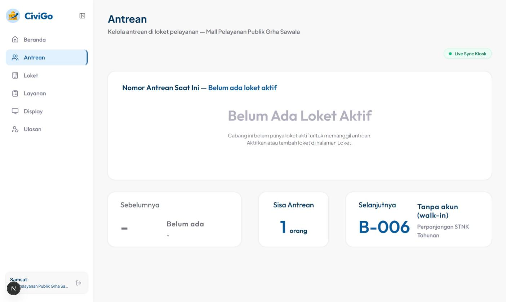

---

## Profil & ubah password (`/admin/profil`, daftar baru #4–#5, 06/10/2026)

Tugas dari daftar baru [`todos.txt`](./todos.txt) (web-dashboard #4 dan #5). Menggantikan Web #6: password diubah
**setelah login**, tanpa OTP atau email.
**Kode:** `app/admin/profil/page.tsx`, `updateProfileName()` dan `changePassword()` di `lib/auth/actions.ts`,
`app/components/admin/ProfileNameForm.tsx`, `ChangePasswordForm.tsx`, `app/components/PasswordInput.tsx`.

### Alur langkah demi langkah

**A. Membuka profil**

| # | Petugas | Sistem & layar |
|---|---|---|
| 1 | Klik **Profil** di sidebar (paling bawah daftar menu). | Halaman Profil: kartu **Informasi Akun** dan kartu **Ubah Password**. |
| 2 | — | Email, peran, instansi, dan cabang tampil sebagai teks (hanya baca), dengan catatan bahwa yang mengatur adalah admin. |

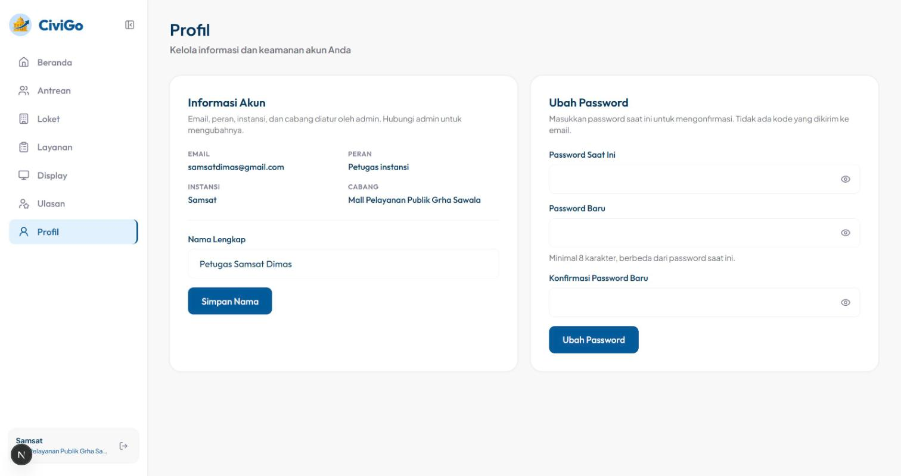

**B. Mengubah nama lengkap**

| # | Petugas | Sistem & layar |
|---|---|---|
| 1 | Mengubah **Nama Lengkap**, klik **Simpan Nama**. | Server memakai sesi petugas sendiri (bukan service_role). RLS hanya mengizinkan baris milik sendiri, dan grant kolom untuk `authenticated` hanya `full_name`. |
| 2 | — | Pesan: `Nama lengkap berhasil diperbarui.` |

**C. Mengubah password**

| # | Petugas | Sistem & layar |
|---|---|---|
| 1 | Mengisi **Password Saat Ini**, **Password Baru**, dan **Konfirmasi Password Baru**. Ikon mata di tiap kolom menampilkan/menyembunyikan isinya. | — |
| 2 | Klik **Ubah Password**. | Server memvalidasi isian, lalu mengecek password saat ini dengan login sekali pakai (tanpa cookie). Sesi cek itu langsung dicabut (scope `local`). |
| 3 | — | Server memanggil `updateUser({ password })` untuk sesi petugas. Pesan: `Password berhasil diubah. Gunakan password baru saat login berikutnya.` |
| 4 | — | Kolom dikosongkan setelah setiap submit. Sesi di loket lain **tidak** dikeluarkan, karena satu akun cabang bisa dipakai beberapa loket. |

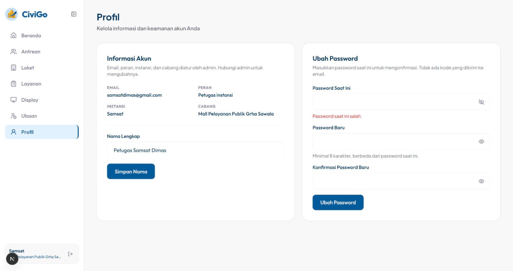

### Semua kasus

| Kasus | Hasil |
|---|---|
| Nama kurang dari 2 / lebih dari 100 karakter | `Nama lengkap minimal 2 karakter.` / `Nama lengkap maksimal 100 karakter.` |
| Password saat ini kosong | `Password saat ini wajib diisi.` |
| Password baru kurang dari 8 karakter | `Password baru minimal 8 karakter.` |
| Password baru sama dengan password saat ini | `Password baru harus berbeda dari password saat ini.` |
| Konfirmasi tidak sama | `Konfirmasi password tidak sama dengan password baru.` |
| Password saat ini salah | `Password saat ini salah.` Password tidak berubah. |
| Terlalu banyak percobaan (rate limit Supabase) | `Terlalu banyak percobaan. Tunggu beberapa menit lalu coba lagi.` |
| Password ditolak Supabase karena lemah | `Password terlalu lemah: …` |
| "Require reauthentication" aktif di dashboard dan sesi lebih dari 24 jam | `Sesi login Anda sudah lebih dari 24 jam. Keluar lalu masuk lagi, kemudian ubah password.` |
| Sesi habis | Diarahkan ke halaman login. |
| Ingin mengubah email/peran/instansi/cabang | Tidak tersedia di halaman Profil; diatur admin. |
| Lupa password | Tidak ada alur mandiri; password direset admin (Supabase Dashboard → Authentication → Users). |

### Toggle tampilkan password

`PasswordInput` dipakai di form login dan ketiga kolom password di Profil. Tombolnya `type="button"` (tidak men-submit
form), label aksesibilitasnya berganti antara "Tampilkan password" dan "Sembunyikan password", dan `aria-pressed`
mengikuti keadaannya.

### Hubungan dengan endpoint mobile

Aplikasi mobile memakai `POST /api/auth/change-password` (Satya, `732df00`) dengan aturan yang sama: minimal 8 karakter
dan password saat ini wajib benar. Bedanya, endpoint itu meng-`trim()` password dan tidak mencabut sesi yang dibuat
saat mengecek password lama.

---

## Kios walk-in tanpa sesi jam (`/display/select-layanan`, daftar baru #2, 06/10/2026)

Tugas web-dashboard #2 di [`todos.txt`](./todos.txt): warga yang datang langsung tidak lagi memilih sesi jam di kios.
**Kode:** `app/components/display/KioskServiceSelection.tsx`, `app/components/display/CheckInForm.tsx`,
`bookQueue()` di `lib/queue/book.ts`.

### Alur langkah demi langkah

| # | Warga di kios | Sistem & layar |
|---|---|---|
| 1 | Memilih **Belum Mendaftar**, lalu memilih layanan instansi yang buka di cabang kios ini (bisa dicari atau disaring per instansi). | Muncul form: nama layanan, estimasi pengerjaan, **jam layanan instansi** ("Jam layanan 08:00 – 16:00. Dilayani sesuai urutan nomor antrean."), dokumen, tanggal, dan NIK. Tidak ada pilihan sesi jam. |
| 2 | Mengisi NIK 16 digit, klik **Ambil Nomor Antrean**. | Kios memanggil `POST /api/queue/book` dengan `location_id` cabang kios dan **tanpa** `time_block`. |
| 3 | — | Server mengecek jam operasional (lihat aturan di bawah), mencegah booking ganda, lalu menerbitkan nomor. |
| 4 | — | Untuk tanggal hari ini, kios langsung mencatat kehadiran (`present`). Struk menampilkan nomor, layanan, tanggal, dan **Estimasi Layanan** (bukan sesi jam). |
| 5 | (Opsional) Memasukkan nomor di **Sudah Mendaftar**. | "Anda sudah check-in" dengan kartu nomor antrean; baris "Sesi:" tidak ditampilkan untuk tiket tanpa sesi. |

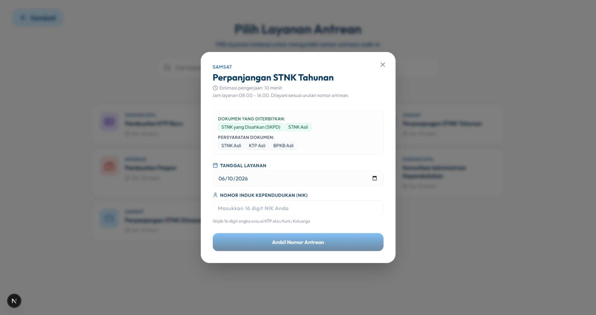
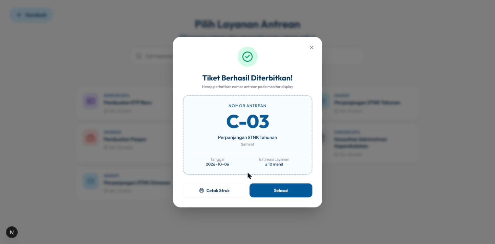
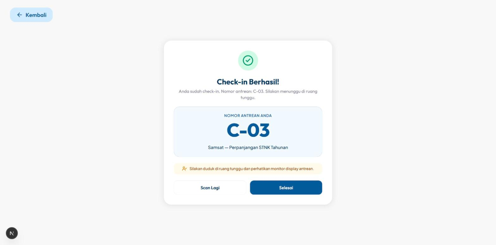

### Aturan jam operasional tanpa sesi

Kapasitas dijaga jam operasional, bukan kuota (keputusan tetap). Dulu aturannya hanya berlaku lewat sesi; sekarang
booking **hari ini tanpa sesi** memakai jam mulai = sekarang, atau jam buka kalau instansi belum buka:

| Kasus (contoh Samsat 08:00–16:00, layanan 30 menit) | Hasil |
|---|---|
| Pukul 10:00 | Tiket terbit. |
| Pukul 06:30 (belum buka) | Tiket terbit; dilayani mulai jam buka. |
| Pukul 15:45 (selesai 16:15) | `422 SERVICE_EXCEEDS_CLOSING`: `Layanan … (30 menit) tidak akan selesai sebelum Samsat tutup pukul 16:00.` |
| Pukul 16:30 | `422 OUTSIDE_OPERATING_HOURS`: `Samsat sudah tutup hari ini (jam operasional 08:00 - 16:00).` |
| Tanggal lain (besok, dst.) | Jam sekarang tidak dipakai; hanya dicek hari operasional (`AGENCY_CLOSED` kalau libur). |
| `next dev` atau `ALLOW_OFFHOURS_TESTING="true"` | Cek jam operasional dilewati, supaya kios bisa diuji malam/akhir pekan. Ini satu-satunya pengecualian: sejak 06/10/2026 sesi mulai ≥ 18:00 dan booking hari ini di hari libur **tidak** lagi otomatis lolos di production. |

### Cabang kios (`?locationId=`)

Kios tidak login, jadi cabangnya ikut di URL, sama seperti layar TV:

| # | Siapa | Yang terjadi |
|---|---|---|
| 1 | Petugas membuka **Display → Mesin Kios** dari dasbor. | Kios terbuka di `/display?locationId=<cabang petugas>`. Layar TV dari dialog yang sama juga membawa `?locationId=`. |
| 1b | Atau perangkat membuka `/display` tanpa lokasi. | Muncul "Kios ini berada di lokasi mana?" dengan daftar cabang; dipilih sekali saat memasang kios. |
| 2 | — | Beranda kios menampilkan "Lokasi kios: …" dan tautan **Ganti lokasi**. Semua tautan kios (Sudah/Belum Mendaftar, Kembali, Selesai) membawa `?locationId=`. |
| 3 | Warga memilih **Belum Mendaftar**. | Hanya layanan instansi yang buka di cabang itu (`agency_locations`) yang tampil, mis. Kantor Samsat Bandung Timur: Samsat saja. |
| 4 | Warga mengambil nomor. | Kios mengirim `location_id`; tiket muncul di dasbor dan TV cabang itu, bukan di MPP. |

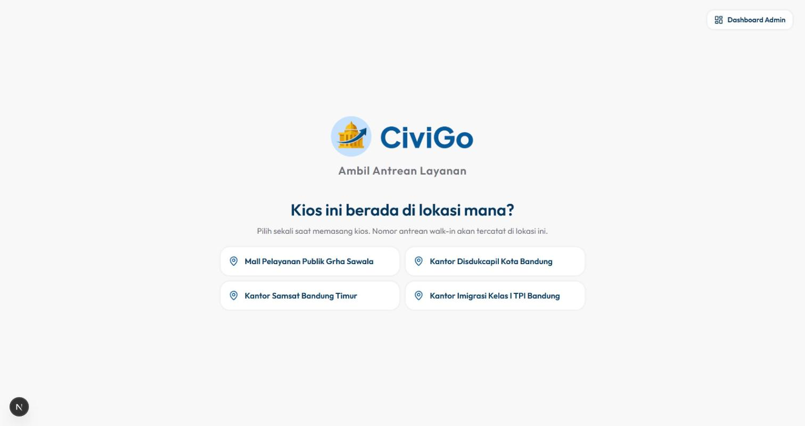
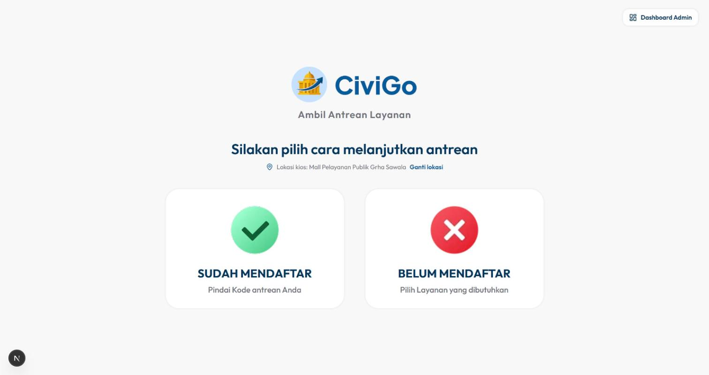

| Kasus cabang | Hasil |
|---|---|
| Halaman kios dibuka tanpa `?locationId=` atau dengan id yang tidak ada | `/display` menampilkan pemilih lokasi; `/display/select-layanan` dan `/display/input-code` dialihkan ke sana. |
| Booking untuk instansi yang tidak buka di cabang itu (mis. Samsat di Kantor Disdukcapil) | `422 AGENCY_NOT_AT_LOCATION`: `Samsat tidak membuka layanan di lokasi ini. Silakan ambil antrean di lokasi Samsat.` |
| Klien tanpa `location_id` (mis. mobile lama) | Tetap lokasi 1 (MPP); semua instansi buka di MPP. |
| Akun petugas tanpa `location_id` membuka kios dari dasbor | Kios meminta lokasinya dipilih dulu. |

### Semua kasus lain

| Kasus | Hasil |
|---|---|
| NIK bukan 16 digit | Tombol nonaktif; kalau tetap terkirim: `NIK wajib terdiri dari 16 digit angka.` |
| NIK yang sama sudah punya antrean aktif untuk layanan & tanggal itu | `409 DUPLICATE_BOOKING` dengan nomor antrean yang sudah ada. |
| NIK cocok dengan akun warga | Tiket ditautkan ke akun itu (muncul di aplikasi mobile warga). |
| Tanggal sudah lewat / lebih dari 30 hari ke depan | `DATE_IN_PAST` / `DATE_TOO_FAR`. |
| Klien lain (mis. mobile) masih mengirim `time_block` | Tetap didukung dengan aturan sesi yang lama. |

---

## Beranda: rentang waktu (`/admin`, daftar baru #3, 06/10/2026)

Tugas web-dashboard #3 di [`todos.txt`](./todos.txt). **Kode:** `app/admin/page.tsx`,
`app/components/admin/RangeSelect.tsx`, `getQueueOutcome()` dan `getServiceDonutData()` di `lib/data/admin.ts`,
`dateRangeBounds()` / `parseDateRange()` di `lib/queue/time.ts`.

### Rentang

| Pilihan | Tanggal (WIB, inklusif) |
|---|---|
| Hari ini | hari ini |
| Minggu ini | Senin minggu berjalan s.d. hari ini |
| Bulan ini | tanggal 1 s.d. hari ini |

Semua rentang berakhir hari ini: tiket bertanggal mendatang belum punya hasil hadir/hangus.

### Alur langkah demi langkah

| # | Petugas | Sistem & layar |
|---|---|---|
| 1 | Membuka **Beranda**. | Baris pertama (Total, Selesai, Sisa, Rata-rata) tetap **hari ini**. "Tingkat Kehadiran" dan "Antrean Hangus" default **Hari ini**, "Antrean Per Layanan" default **Minggu ini**. |
| 2 | Memilih rentang di pojok kanan atas salah satu kartu. | Parameter URL kartu itu berubah (`?kehadiran=`, `?hangus=`, atau `?layanan=`) dan server menghitung ulang. Kartu lain tidak berubah. |
| 3 | — | Tampilan bertahan saat di-refresh atau dibagikan, karena pilihannya ada di URL. |

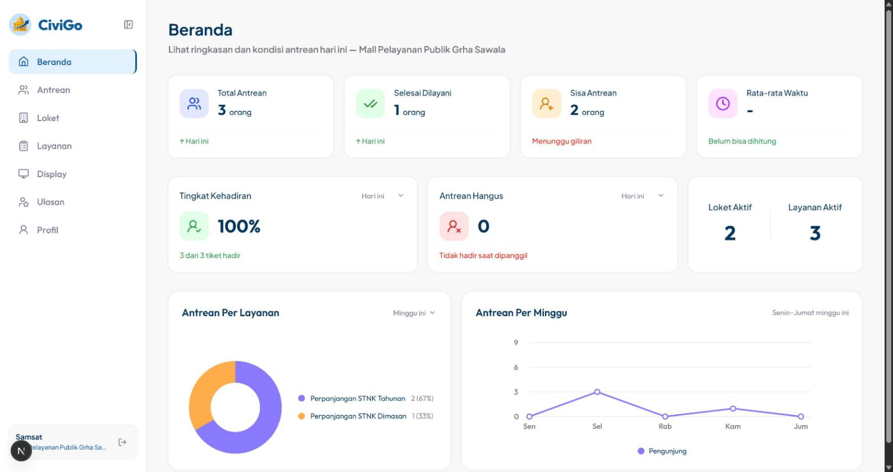
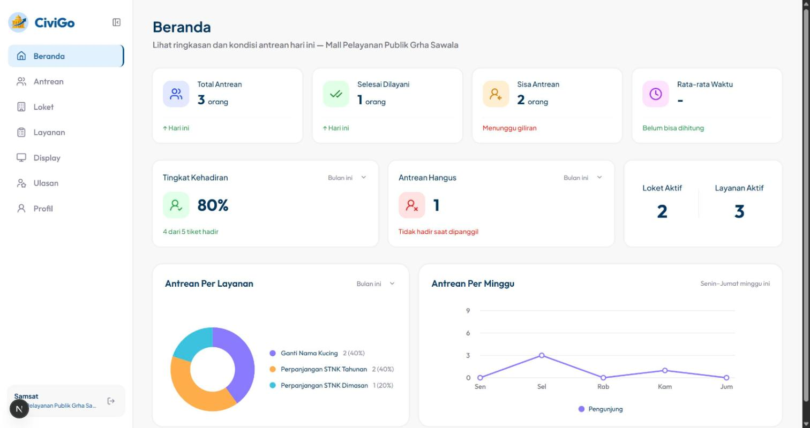

### Isi kartu

| Kartu | Isi |
|---|---|
| **Tingkat Kehadiran** | Hadir ÷ (hadir + hangus), "-" kalau belum ada keduanya. Hadir = `present`, `served`, `completed`; tiket yang masih `scheduled` belum punya hasil dan **tidak** dihitung. Keterangan: "4 dari 5 tiket hadir". Dulu rumusnya (total − hangus) ÷ total, sehingga semua booking yang belum datang ikut terhitung hadir. |
| **Antrean Hangus** | Jumlah tiket `skipped` dalam rentang. |
| **Antrean Per Layanan** | Jumlah dan persentase per layanan dalam rentang, dikelompokkan per id layanan. Kosong → "Belum ada antrean pada periode ini". Dulu menghitung semua tiket sepanjang masa (meski labelnya "Minggu Ini") dan menampilkan layanan 0% kalau kosong. |
| **Antrean Per Minggu** | Tanpa dropdown (keputusan 06/10/2026): selalu Senin–Jumat minggu berjalan. |

### Semua kasus

| Kasus | Hasil |
|---|---|
| Nilai URL asing (`?kehadiran=tahun-ini`) | Dianggap default kartu itu. |
| Belum ada tiket hadir/hangus dalam rentang | Kehadiran "-", keterangan "Belum ada tiket hadir atau hangus". |
| Tidak ada antrean dalam rentang | Antrean Per Layanan menampilkan empty state. |
| Rata-rata Waktu belum bisa dihitung | "-" dengan keterangan "Belum bisa dihitung" (dulu "null menit"). |
| Query gagal | Error dilempar (tidak diganti data karangan). |
| Petugas terikat cabang | Semua angka dibatasi instansi + cabang petugas. |

Diverifikasi 06/10/2026 dengan data Samsat MPP: Hari ini 100% (3 dari 3), hangus 0; Bulan ini 80% (4 dari 5), hangus 1;
per layanan minggu ini 2 (67%) / 1 (33%), bulan ini 2 (40%) / 2 (40%) / 1 (20%) — sama dengan hitungan langsung di database.

---

## Web #6 — Halaman reset password (tidak dilanjutkan)

Tidak dilanjutkan (06/10/2026): diganti ubah password setelah login (lihat bagian sebelumnya). Kondisi alur email yang tersisa:

1. Alur **lupa password** sudah ada: `requestPasswordReset()` (web) dan `POST /api/auth/forgot-password` (mobile)
   memanggil `supabase.auth.resetPasswordForEmail()`. Kasus yang sudah ditangani:
   - email kosong → `Email wajib diisi.`;
   - format salah → `Format email tidak valid.`;
   - berhasil → `Tautan reset kata sandi telah dikirim ke email Anda. Silakan periksa inbox atau spam.`
2. Tautan di email mengarah ke `<NEXT_PUBLIC_SITE_URL>/reset-password`, dan **halaman itu belum ada (404)**.
3. Endpoint penyimpan password baru, `POST /api/auth/reset-password`, sudah ada. Sejak 03/10/2026 (Satya) endpoint ini menerima
   sesi cookie **atau** header `Authorization: Bearer <token>`. Halaman yang akan dibuat bisa memakai salah satunya.

---

## Perbaikan setelah audit (03/10/2026)

Audit Web #1–#5 sore hari menemukan beberapa celah di sekitar fitur yang sudah selesai. Yang diperbaiki:

| # | Masalah | Tugas | Perbaikan | Diverifikasi |
|---|---|---|---|---|
| 1 | Kartu **Sebelumnya** menampilkan tiket bernomor terbesar, bukan yang terakhir selesai. Salah begitu ada tiket dimundurkan (B-001 selesai terakhir, kartu menampilkan B-004). | #5 | Kolom baru `queues.completed_at`, diisi trigger `queues_set_completed_at` (migrasi `20261003115823`). Dasbor memilih tiket dengan `completed_at` terbaru (`latestCompleted()` di `lib/queue/ordering.ts`). | Simulasi B-001…B-004: kartu = B-001, tetap B-001 setelah reload; `completed_at` terisi urut. |
| 2 | Loket nonaktif tetap muncul sebagai tab di halaman Antrean; memanggil ke sana gagal `COUNTER_INACTIVE`. Kalau cabang tidak punya loket, dasbor diam-diam memakai loket id 1 (milik Disdukcapil). | #1, #5 | Halaman Antrean hanya mengirim loket aktif. Tanpa loket aktif: tampilan "Belum Ada Loket Aktif", tanpa tombol panggil. | Loket 1 Samsat dinonaktifkan sementara: tab hilang, pesan muncul, lalu dipulihkan. |
| 3 | "Live Sync Kiosk" sebenarnya polling 12 detik. Langganan `postgres_changes` tidak pernah menerima tiket warga karena RLS `queues` hanya `auth.uid() = user_id`. | #5 | Dasbor berlangganan broadcast `display:agency:<id>` yang sudah dipakai layar TV. Polling cadangan 30 detik. | Tiket baru dan tiket dihanguskan lewat database muncul di dasbor dalam 2,4 dan 1,9 detik. |
| 5 | Contoh username `disdukcapil.surabaya` menyiratkan username per cabang berfungsi. | #4 | Contoh diganti `disdukcapil atau email lengkap akun Anda`. | Perubahan teks. |
| 6 | Baris "Sesi:" kosong untuk tiket tanpa sesi jam. | #5 | Baris disembunyikan; rincian menampilkan "Tanpa sesi". `QueueItem.time_block` kini bertipe `string \| null`. | Screenshot di Web #5 langkah B. |

Masalah #4 dan #7 dari audit belum diperbaiki dan dicatat di bawah.

---

## Masalah yang masih diketahui

| Masalah | Tugas | Dampak | Catatan |
|---|---|---|---|
| Hapus loket hanya mengecek riwayat **antrean**, bukan **ulasan**. | #1 | Loket yang punya ulasan tapi tanpa antrean bisa dihapus; ulasannya kehilangan loket (`reviews.counter_id` ON DELETE SET NULL). | Jarang terjadi, karena ulasan berasal dari antrean. Hapus layanan sudah mengecek keduanya. |
| Nama loket tidak dicek unik dan tidak dibatasi panjang. | #1 | Dua "Loket 1" di cabang yang sama bisa dibuat. | Tidak ada constraint di database juga. |
| Nama layanan unik hanya dicek aplikasi. | #2 | Dua penyimpanan bersamaan dengan nama sama bisa lolos. | Tidak ada constraint unik `(agency_id, name)` di database. |
| Akun per cabang tidak bisa login lewat username. | #4 | `disdukcapil.mpp` dan `disdukcapil.induk` sama-sama menjadi `disdukcapil@civigo.com`. | Pakai email lengkap. |
| Mundurkan tidak dibatasi jumlah dan tidak dicek cabang. | #5 | Tiket bisa dimundurkan berkali-kali; API mengecek instansi tapi tidak `location_id`. | Risiko rendah; diputuskan di luar cakupan Web #5. |
| `super_admin` tanpa instansi selalu melihat instansi id 1. | semua | — | Belum ada akun `super_admin`, jadi belum berdampak. |
| Check-in kios tidak mengecek cabang tiket. | kios | Tiket cabang A bisa di-check-in di kios cabang B. | Nomor antrean unik per layanan per hari, jadi tiketnya tetap benar; hanya lokasi check-in yang tidak dicek. |
| Durasi layanan rata-rata belum bisa dihitung. | — | Beranda menampilkan "-". | Sudah ada `completed_at`, tapi belum ada waktu mulai dilayani (`served_at`). |

---

## Lampiran

### Cara menguji

- Jalankan `pnpm dev`, login sebagai akun petugas (lihat bagian 8B `supabase-backend-integration-notes.md`).
- Untuk menguji booking di luar jam operasional (malam/akhir pekan), tambahkan ke `.env.local`:
  `ALLOW_OFFHOURS_TESTING="true"`. Flag ini hanya dibaca saat booking. Memanggil, menyelesaikan, menghanguskan,
  dan memundurkan antrean tidak dicek jam operasional.
- Test otomatis: `npx vitest run` (155 test per 06/10/2026, semua di-mock, tidak memakai kuota apa pun).

### File utama per tugas

| Tugas | File |
|---|---|
| Web #1 | `lib/data/counter-actions.ts`, `app/components/admin/LoketTableManager.tsx`, `app/admin/loket/` |
| Web #2 | `lib/data/service-actions.ts`, `lib/data/admin.ts` (`getAdminServices`, `getServiceDocuments`), `app/components/admin/LayananManager.tsx`, `ServiceDocumentPicker.tsx` |
| Web #3 | `app/admin/ulasan/page.tsx`, `lib/data/admin.ts` (`getAdminReviews`, `getReviewFilterOptions`), `app/api/reviews/route.ts` |
| Web #4 | `lib/auth/actions.ts`, `lib/auth/session.ts`, `app/components/auth/LoginForm.tsx` |
| Beranda rentang waktu (#3 baru) | `app/admin/page.tsx`, `app/components/admin/RangeSelect.tsx`, `PerformanceCard.tsx`, `ServiceDonutChart.tsx`, `WeeklyQueueChart.tsx`, `lib/data/admin.ts` (`getQueueOutcome`, `getServiceDonutData`), `lib/queue/time.ts`, `tests/unit/dashboard-ranges.test.ts` |
| Kios tanpa sesi & cabang (#2 baru) | `app/display/page.tsx`, `app/display/select-layanan/page.tsx`, `app/display/input-code/page.tsx`, `lib/data/kiosk.ts`, `app/components/display/KioskServiceSelection.tsx`, `app/components/display/CheckInForm.tsx`, `app/components/admin/Sidebar.tsx`, `DisplayConfirmModal.tsx`, `lib/queue/book.ts`, `tests/unit/book-without-session.test.ts` |
| Profil (#4–#5 baru) | `app/admin/profil/page.tsx`, `lib/auth/actions.ts` (`updateProfileName`, `changePassword`), `app/components/admin/ProfileNameForm.tsx`, `ChangePasswordForm.tsx`, `FormStatus.tsx`, `app/components/PasswordInput.tsx` |
| Web #5 | `lib/queue/ordering.ts`, `lib/queue/status.ts`, `lib/data/admin.ts` (`getTodayQueues`), `app/components/admin/AntreanManager.tsx`, `app/admin/antrean/page.tsx`, `app/display/[agencyId]/antrean/page.tsx`, `supabase/migrations/20261003115823_add_completed_at_to_queues.sql` |

### Riwayat commit

| Commit | Tanggal | Oleh | Isi |
|---|---|---|---|
| `810cd50` | 12/09/2026 | Satya | Integrasi auth instansi, dasbor admin, antrean, display realtime (Web #4) |
| `fc2166e` | 18/09/2026 | Satya | Integrasi kios, walk-in, grafik beranda, manajemen loket (Web #1) |
| `2ee9967` | 28/09/2026 | Dimas | Aksi loket dibatasi instansi + cabang petugas (Web #1) |
| `34ec583` | 28/09/2026 | Dimas | PR #1: CRUD layanan & filter ulasan asli (Web #2, #3) |
| `022c289` | 28/09/2026 | Dimas | `POST /api/reviews` menolak relasi lintas instansi (Web #3) |
| `c79295e` | 03/10/2026 | Dimas | Prasyarat kondisi di pemilih dokumen (Web #2 follow-up) |
| `06f5a8a` | 03/10/2026 | Dimas | Tombol Mundurkan Antrean dan satu urutan panggil (Web #5) |
| `76cd9ff` | 03/10/2026 | Dimas | Perbaikan hasil audit: `completed_at`, loket aktif saja, realtime dasbor, contoh username, tanpa sesi |
| `9c6273d` | 06/10/2026 | Satya | Urutan panggil tidak lagi mendahulukan tiket yang sudah check-in; penanda check-in di dasbor |

### Dokumen terkait

- [`todos-arsip-03-10-2026.txt`](./todos-arsip-03-10-2026.txt): daftar tugas lama tempat Web #1–#6 berasal. Tugas aktif sejak 06/10/2026 ada di [`todos.txt`](./todos.txt).
- [`business-flow-notes.md`](./business-flow-notes.md): alur bisnis dan keputusan arsitektur (poin 5.7–5.11 untuk tugas Web).
- [`web5-mundurkan-antrean.md`](./web5-mundurkan-antrean.md): simulasi lengkap Web #5.
- [`supabase-backend-integration-notes.md`](./supabase-backend-integration-notes.md): endpoint API, akun uji, data dummy.
