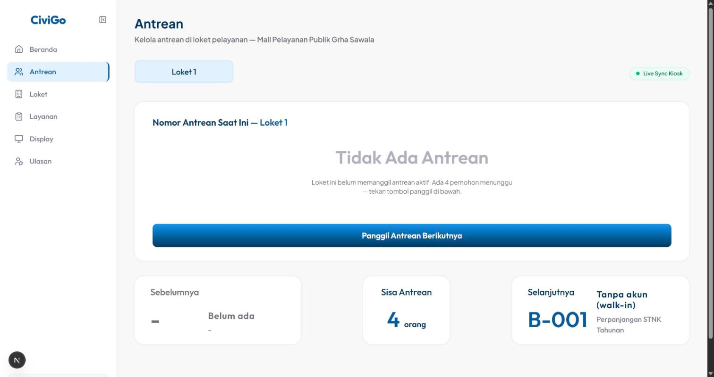
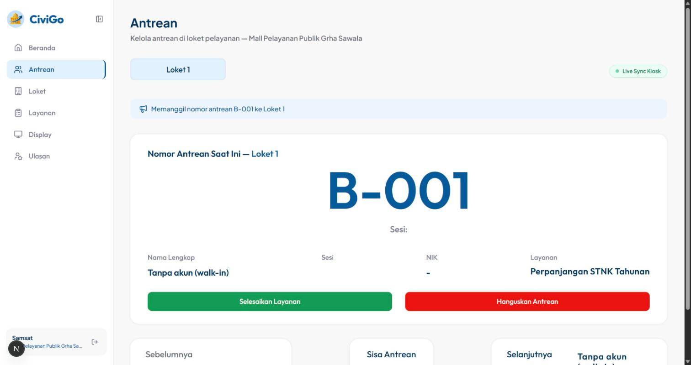
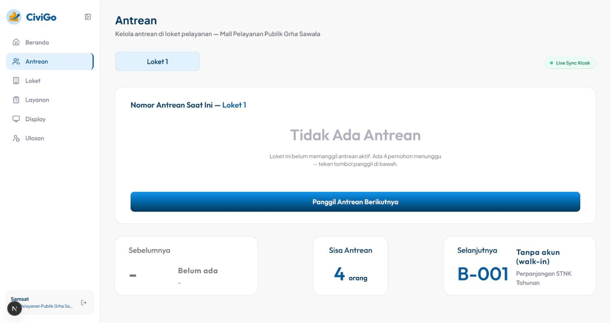
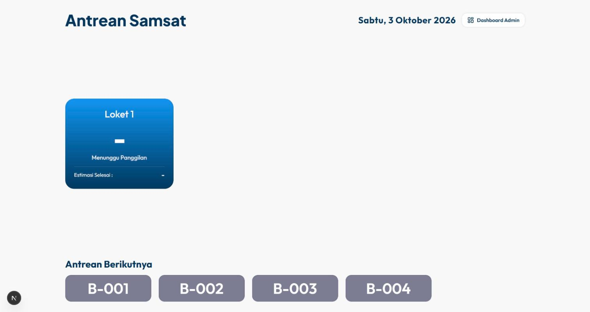
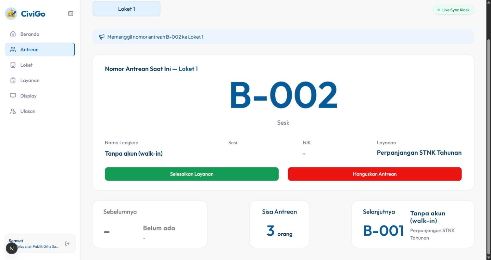
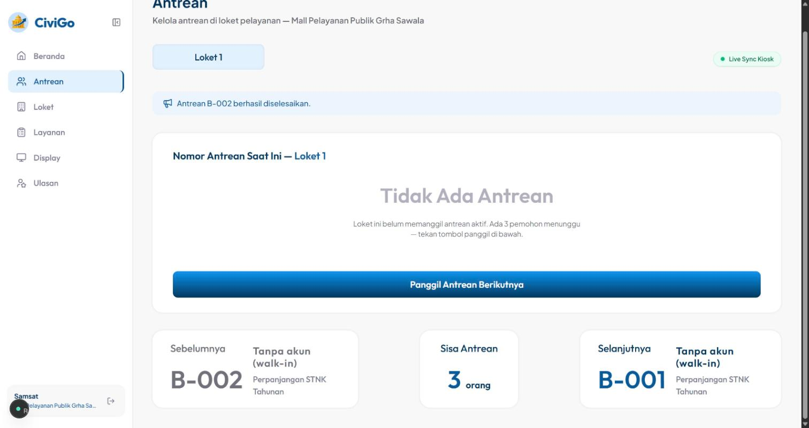
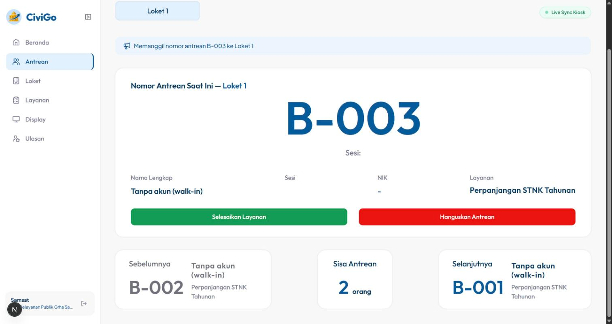

# Web #5 — Tombol "Mundurkan Antrean": temuan, simulasi, dan rencana

Disusun 03/10/2026 sebelum Web #5 dikerjakan, lalu diperbarui setelah keputusan dan perbaikan
(lihat [Keputusan & hasil setelah perbaikan](#keputusan--hasil-setelah-perbaikan)).
Semua temuan dibuktikan lewat simulasi nyata di dev server (`localhost:3000`, akun petugas Samsat,
Loket 1, MPP Grha Sawala) memakai Claude in Chrome dan DB remote.

## Ringkasan

| | |
|---|---|
| **Blocker keras** | Tidak ada. API `POST /api/queue/[id]/postpone` sudah ada, kolom `queues.postponed` / `postponed_at` sudah ada di DB remote, dan "Panggil Antrean Berikutnya" sudah menaruh tiket yang dimundurkan di belakang. |
| **Masalah 1** | Kartu **"Selanjutnya"** di dasbor dan daftar **"Antrean Berikutnya"** di layar TV diurutkan per **nomor tiket**, bukan per urutan panggil. Setelah tiket dimundurkan, keduanya tetap menampilkan tiket itu paling depan. |
| **Masalah 2** | API postpone menerima tiket yang **belum datang** (`scheduled`) dan mengubahnya jadi `present`. Sistem jadi mencatat orang yang tidak ada di ruangan sebagai hadir. |
| **Pertanyaan** | Tiket yang dimundurkan saat ini ditaruh di belakang **semua orang**, termasuk yang booking tapi **belum datang**. Perlu dipilih: tetap begitu (opsi a) atau di belakang yang **hadir** saja (opsi b). |
| **Keputusan (03/10/2026)** | **Opsi A** (urutan panggil tetap). Masalah 1 dan Masalah 2 **diperbaiki**. |

## Cara kerja sekarang

- **Panggil Antrean Berikutnya** (`callNextQueue`, `lib/queue/status.ts`) mengurutkan tiket menunggu hari ini:
  1. Belum pernah dimundurkan dulu, yang `postponed = true` paling belakang.
  2. `present` (sudah check-in di kios) sebelum `scheduled` (booking tapi belum check-in).
  3. Sesama dimundurkan: siapa yang dimundurkan lebih dulu (`postponed_at`).
  4. Sesi jam (`time_block`), lalu nomor antrean.
- **Mundurkan** (`postponeQueue`, `lib/queue/status.ts`): tiket apa pun yang belum `completed`/`skipped` diubah jadi
  `status = 'present'`, `counter_id = null`, `postponed = true`, `postponed_at = now()`.
- **Kartu "Selanjutnya" & "Sisa Antrean"** (`AntreanManager.tsx`) mengambil tiket `present`/`scheduled` dari
  `getTodayQueues()` yang diurutkan `order("queue_number")`, lalu memakai yang pertama.
- **Layar TV** (`app/display/[agencyId]/antrean/page.tsx`) mengurutkan "Antrean Berikutnya" dengan `localeCompare` nomor tiket.

Jadi ada **dua urutan berbeda**: satu untuk memanggil, satu untuk menampilkan. Selama tidak ada yang dimundurkan
dan semua sudah check-in, keduanya kebetulan sama. Fitur mundurkan justru membuat keduanya berbeda.

## Simulasi

### Data uji

Dibuat langsung di DB untuk hari ini (Sabtu, 03/10/2026), layanan Samsat "Perpanjangan STNK Tahunan",
lokasi 1. Semua sudah **dihapus** setelah simulasi.

| Tiket | Status awal | Artinya |
|---|---|---|
| B-001 | `present` | Sudah check-in, ada di ruangan |
| B-002 | `present` | Sudah check-in, ada di ruangan |
| B-003 | `scheduled` | Booking, **belum datang** |
| B-004 | `scheduled` | Booking, **belum datang** |

Tombol "Mundurkan" belum ada, jadi langkah "mundurkan" di bawah memanggil API yang sudah ada
(`POST /api/queue/{id}/postpone`) dari sesi petugas di browser yang sama. Inilah yang nanti dipanggil tombolnya.

### Langkah 1 — Kondisi awal

4 orang menunggu, "Selanjutnya" = B-001. Benar.

### Langkah 2 — Panggil: B-001 dilayani di Loket 1

### Langkah 3 — B-001 minta waktu ("fotokopi KK dulu"), petugas memundurkannya

Respons API: `"Antrean B-001 berhasil dimundurkan ke urutan paling akhir."`

Setelah halaman dimuat ulang, **"Selanjutnya" tetap B-001**, padahal B-001 baru saja dimundurkan ke paling belakang.
**→ Masalah 1.**

Layar TV juga menaruh **B-001 paling depan** di "Antrean Berikutnya". Warga B-001 mengira dirinya dipanggil
berikutnya, warga B-002 mengira masih menunggu.

### Langkah 4 — Petugas menekan "Panggil Antrean Berikutnya"

Kartu bilang B-001, tetapi yang dipanggil **B-002** (urutan panggil sudah benar). Setelahnya kartu
"Selanjutnya" **masih** menampilkan B-001.

### Langkah 5 — B-002 selesai, panggil lagi (inti pertanyaan opsi a/b)

B-002 diselesaikan. Kartu "Selanjutnya" = B-001, dan B-001 memang **sudah kembali di ruangan**.

Petugas menekan "Panggil Antrean Berikutnya". Yang dipanggil **B-003**, yang **belum pernah datang**,
bukan B-001 yang sudah menunggu di depan loket. Di loket sungguhan petugas akan memanggil B-003 (tidak ada),
menghanguskannya, lalu B-004 (tidak ada), menghanguskannya, baru B-001.

### Langkah 6 — Mundurkan tiket yang belum datang (B-004) lewat API

Hasil query DB sebelum dan sesudah `POST /api/queue/{B-004}/postpone`:

| Tiket | Sebelum | Sesudah |
|---|---|---|
| B-004 | `scheduled`, `postponed = false` | **`present`**, `postponed = true` (09:02:55 WIB) |

API menjawab `200 OK`. Pemegang B-004 tidak pernah check-in, tetapi sekarang tercatat hadir. **→ Masalah 2.**

## Masalah 1 — Dua urutan berbeda untuk "siapa berikutnya"

**Dampak:** setelah satu tiket dimundurkan, kartu "Selanjutnya" di dasbor dan daftar di TV salah sampai tiket itu
dipanggil lagi. Terbukti di langkah 3, 4, dan 5.

**Perbaikan:** satu fungsi urutan bersama (mis. `lib/queue/ordering.ts`), diambil dari isi `callNextQueue`, lalu dipakai di:
- `callNextQueue` (perilakunya tidak berubah, hanya dipindah),
- `getTodayQueues` / `AntreanManager` (kartu "Selanjutnya" dan "Sisa Antrean"),
- query layar TV (`/display/[agencyId]/antrean`).

`getTodayQueues` dan query TV perlu ikut mengambil `postponed` dan `postponed_at`.

## Masalah 2 — API postpone menandai orang yang belum datang sebagai hadir

**Dampak nyata** (sudah dicek di kode):
- `present` adalah sinyal "orangnya ada di ruangan". `callNextQueue` memakainya untuk memprioritaskan yang hadir,
  dan **opsi b di bawah sangat bergantung pada sinyal ini**. Dengan opsi b, tiket palsu-hadir seperti B-004
  akan disusulkan ke depan orang-orang yang booking.
- Kalau pemegang B-004 akhirnya datang dan scan QR di kios, `POST /api/queue/check-in` menjawab
  "Anda sudah check-in", padahal ia belum pernah check-in.
- Koreksi dari penjelasan saya sebelumnya: angka analitik **tidak** terpengaruh, karena `attendance_rate` = `completed / total`.

**Perbaikan:** `postponeQueue` hanya menerima tiket berstatus `served` (yang sedang dilayani di loket),
status lain ditolak `422`. Ini satu syarat di kode Satya. Endpoint ini hanya untuk petugas (mobile tidak memanggilnya),
jadi tidak ada yang rusak di luar dasbor. Tombol yang akan dibuat juga hanya muncul untuk tiket yang sedang dilayani.

## Pertanyaan — Seberapa jauh tiket dimundurkan?

Urutan yang dibandingkan, dengan contoh simulasi di atas setelah B-002 selesai
(B-001 dimundurkan tapi hadir; B-003, B-004 belum datang):

| | Urutan panggil | Hasil di simulasi |
|---|---|---|
| **a. Tetap seperti sekarang** ("paling akhir" harfiah) | belum dimundurkan (hadir → belum datang) → dimundurkan | B-003 → B-004 → **B-001**. Petugas harus menghanguskan 2 tiket kosong dulu. |
| **b. Di belakang yang hadir saja** (rekomendasi) | hadir & belum dimundurkan → **hadir & dimundurkan** → belum datang | **B-001** → B-003 → B-004. B-001 dipanggil begitu antrean di ruangan habis. |

Kenapa saya merekomendasikan **b**: tujuan "mundurkan" adalah memberi waktu sebentar ke orang yang ada di lokasi,
bukan menghukumnya di belakang orang yang bahkan belum datang. Dengan opsi b, orang yang dimundurkan tetap di belakang
semua yang hadir sekarang, jadi tidak ada yang tersusul.

**Catatan:** opsi b **mewajibkan** perbaikan Masalah 2. Tanpa itu, tiket yang belum datang bisa "dimundurkan"
dan langsung lompat ke depan orang yang booking.

## Rencana pengerjaan

1. **Urutan bersama** (Masalah 1): fungsi urutan di `lib/queue/ordering.ts`, dipakai `callNextQueue`, dasbor, dan layar TV.
   Kalau memilih opsi b, perubahannya cukup di fungsi ini.
2. **Data:** tambah `postponed` dan `postponed_at` ke `getTodayQueues`, tipe `QueueItem`, dan query layar TV.
3. **Tombol "Mundurkan Antrean"** di `AntreanManager`, di samping "Selesaikan Layanan" dan "Hanguskan Antrean",
   hanya saat ada tiket yang sedang dilayani. Polanya sama dengan Hanguskan:
   - optimistic update (tiket hilang dari loket, kembali ke antrean menunggu);
   - `POST /api/queue/{id}/postpone`;
   - pesan "Antrean X dimundurkan ke urutan paling akhir.";
   - `router.refresh()`.

   Tanpa dialog konfirmasi: mundurkan tidak merusak apa pun dan tiketnya masih bisa dipanggil.
4. **Penanda "Dimundurkan"** kecil di kartu "Selanjutnya" kalau tiket berikutnya pernah dimundurkan, supaya petugas tahu
   orang itu mungkin sedang keluar sebentar.
5. **Guard API** (Masalah 2): `postponeQueue` hanya menerima tiket `served`.
6. **Test:** unit test fungsi urutan (termasuk kasus simulasi di atas) dan test guard `served`.
7. **Verifikasi di aplikasi:** ulangi simulasi di dokumen ini dengan tombol asli, lalu hapus data ujinya.
8. **Catatan:** perbarui `todos.txt` dan `business-flow-notes.md`.

## Keputusan & hasil setelah perbaikan

Keputusan 03/10/2026:
- **Opsi A.** Tiket yang dimundurkan tetap di belakang semua orang, termasuk yang belum check-in. Urutan panggil tidak berubah.
- **Masalah 1 diperbaiki.** Kartu "Selanjutnya", "Sisa Antrean", dan layar TV memakai urutan yang sama dengan tombol panggil.
- **Masalah 2 diperbaiki.** Hanya tiket `served` yang bisa dimundurkan.

Yang dikerjakan:

| File | Perubahan |
|---|---|
| `lib/queue/ordering.ts` (baru) | `compareWaiting()` / `sortWaiting()`: urutan panggil yang dipindah apa adanya dari `callNextQueue`. Tanpa akses server, jadi bisa dipakai komponen client. |
| `lib/queue/status.ts` | `callNextQueue` memakai `sortWaiting()`. `postponeQueue` menolak tiket selain `served` (`422 POSTPONE_REQUIRES_SERVED`) dan menulis dengan `.eq("status", "served")` (`409 CONCURRENT_UPDATE` kalau petugas lain mengubahnya lebih dulu). |
| `lib/data/admin.ts` | `getTodayQueues` / `QueueItem` membawa `postponed` dan `postponed_at`. |
| `app/components/admin/AntreanManager.tsx` | Tombol **"Mundurkan Antrean"** (kuning, di antara Selesaikan dan Hanguskan). Daftar menunggu diurutkan `sortWaiting()`. |
| `app/components/admin/AdjacentQueueCard.tsx`, `app/components/Button.tsx` | Label "Dimundurkan" di kartu "Selanjutnya", varian tombol `warning`. |
| `app/display/[agencyId]/antrean/page.tsx` | "Antrean Berikutnya" di TV diurutkan `sortWaiting()`. |
| `app/api/openapi.json/route.ts` | Deskripsi postpone, kode `409` dan `422` yang baru. |
| `tests/unit/queue-ordering.test.ts` (baru), `tests/unit/queue-postpone.test.ts` | Test urutan (termasuk kasus langkah 5) dan test guard `served` + konflik. 94 test lulus. |

Verifikasi ulang di aplikasi dengan data uji yang sama (B-001, B-002 hadir; B-003, B-004 belum datang), kali ini memakai tombol asli.
Data uji dihapus setelahnya.

**1. B-001 dipanggil, tombol "Mundurkan Antrean" muncul.**

**2. Setelah B-001 dimundurkan, "Selanjutnya" = B-002** (sebelumnya masih B-001).

**3. Layar TV: B-002 → B-003 → B-004 → B-001**, sama dengan urutan panggil (opsi A).

**4. Mundurkan B-004 (belum datang) lewat API ditolak.** Respons `422`:
`"Hanya antrean yang sedang dilayani di loket yang dapat dimundurkan. Tiket B-004 berstatus terjadwal."`
B-004 tetap `scheduled` di DB.

**5. Panggil berturut-turut: B-002 → B-003 → B-004**, lalu "Selanjutnya" = **B-001** dengan label **"Dimundurkan"**.

## Di luar cakupan (kecuali diminta)

- **Batas jumlah mundur.** Satu tiket bisa dimundurkan berkali-kali. Setiap kali, ia pindah ke belakang sesama tiket yang dimundurkan.
- **Cakupan cabang di postpone.** `postponeQueue` mengecek instansi tapi tidak cabang (`location_id`). Ini celah yang sama
  dengan yang ditutup untuk loket di Web #1, dengan risiko rendah.
- **Analitik.** `/api/analytics` dan fungsi SQL-nya menghitung status `waiting`, `calling`, `serving`, yang tidak pernah
  ada di `queues` (CHECK hanya mengizinkan `scheduled`, `present`, `served`, `completed`, `skipped`). Ketiga angka itu
  selalu 0. Ini kode Satya dan tidak terkait Web #5.

## Catatan teknis simulasi

- `ALLOW_OFFHOURS_TESTING="true"` sudah ditambahkan ke `.env.local`. Di kode, flag ini hanya dibaca saat **booking**
  (`lib/queue/book.ts`). Memanggil, menyelesaikan, menghanguskan, dan memundurkan tiket tidak dicek jam operasional.
  `next dev` juga sudah melewati cek jam booking.
- Klik mouse simulasi dari ekstensi Chrome tidak sampai ke tombol dasbor (tidak ada request ke API), sedangkan
  `button.click()` lewat DOM bekerja normal dan memanggil handler React yang sama. Ini kendala alat otomasi,
  bukan bug aplikasi. Langkah "klik" di simulasi memakai klik DOM.
- Data uji (B-001 s.d. B-004, 03/10/2026) sudah dihapus dari DB remote setelah simulasi.
